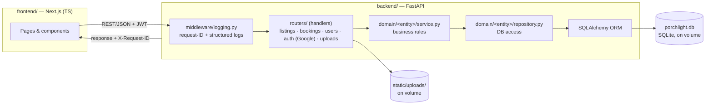

# Porchlight — architecture

## Overview

Porchlight is a modular monolith: one FastAPI backend, one Next.js (TypeScript) frontend, SQLite for storage, local disk for uploaded images. The two apps deploy as separate services in a single Railway project, communicating over REST with JWT auth.

This is a deliberate choice for a 24-hour solo build — see [Trade-offs](#trade-offs) for why microservices and Vercel container functions were ruled out.

## System diagram



## Backend layout

```sh
backend/
├── main.py               app factory, CORS (from config.settings.frontend_url), static mount,
│                           middleware + router wiring, registers domain/errors.py's handlers
├── config.py               Settings singleton (env-backed via pydantic-settings, .env-aware) —
│                              secret key, Google OAuth creds, frontend URL, database URL
├── database.py            SQLAlchemy engine/session, built from config.settings.database_url
├── models/                 ORM models, one file per entity (see DATABASE.md)
├── auth.py                  cross-cutting security infra: bcrypt hashing, JWT issue/verify,
│                              get_current_user dependency, Google OAuth token-exchange plumbing
│                              — not "a domain", used by every domain's protected routes
├── domain/
│   ├── errors.py             shared exceptions (NotFoundError, ForbiddenError, ConflictError,
│   │                          AuthenticationError, BadRequestError) + register_exception_handlers
│   ├── user/                 types.py, validation.py, repository.py, service.py
│   ├── listing/               types.py, validation.py, repository.py, service.py
│   └── booking/                types.py, validation.py, repository.py, service.py
├── seed.py                  seed script (hosts, listings, photos, sample bookings) — not yet built
├── middleware/
│   ├── __init__.py
│   └── logging.py            request-ID middleware + structured logging setup
├── routers/                 thin handlers — parse request, call a domain service, return
│   ├── users.py               signup/login/me
│   ├── auth.py                 Google OAuth login + callback
│   ├── listings.py            search/filter, CRUD (host-only write)
│   ├── bookings.py            create with overlap check, my trips, host dashboard
│   └── uploads.py             image upload endpoint — not yet built
└── static/uploads/            stored listing photos
```

## Layering

Every domain follows **handler → service → repository**:

- **Handler** (`routers/*.py`) — parses the HTTP request into a Pydantic type, calls one service method, returns the result. No business logic, no direct DB access.
- **Service** (`domain/<entity>/service.py`) — owns business rules (uniqueness checks, ownership checks, cross-entity orchestration) and raises plain-Python exceptions from `domain/errors.py`. Has no knowledge of HTTP — it's driven by services in tests/scripts just as easily as by a router.
- **Repository** (`domain/<entity>/repository.py`) — the only place that issues SQLAlchemy queries for that entity.

`domain/errors.py`'s `register_exception_handlers(app)` (called once in `main.py`) is what turns a service's `NotFoundError`/`ForbiddenError`/etc. into the right HTTP status — that's the seam that keeps services HTTP-agnostic without every handler needing its own try/except.

`domain/<entity>/types.py` holds the Pydantic request/response models (Create/Update/Out/Filters — the "Zod for Python" here is just Pydantic, already the base FastAPI is built on); `validation.py` holds the cross-field/business validators as plain functions, wired into `types.py` via `field_validator`/`model_validator`.

`auth.py` is deliberately not inside `domain/user/` — it has no business rules of its own (hashing/JWT mechanics don't change based on what "signup" means) and `get_current_user` is a dependency of every domain's protected routes, not just User's.

## Request flow

1. Frontend calls the backend over `NEXT_PUBLIC_API_URL`, attaching `Authorization: Bearer <jwt>` on authenticated routes.
2. `RequestLogMiddleware` (in `middleware/logging.py`) assigns a short request ID, logs entry/exit with duration, and returns it as an `X-Request-ID` response header for client-side correlation.
3. Handler → service → repository → SQLAlchemy session → SQLite file on a Railway-mounted volume.
4. Image uploads go to `/uploads` as multipart; the backend stores the file under `static/uploads/` and returns a static URL, which the frontend saves on the listing record.

## Data layer

- SQLite file + SQLAlchemy ORM. `Base.metadata.create_all()` runs on startup — no Alembic migrations for this scope.
- Booking overlap validation happens in the service layer via a query (SQLite doesn't support exclusion constraints cleanly), not as a DB constraint.
- Both the SQLite file and `static/uploads/` live on a Railway persistent volume so data survives redeploys and scale events.

## Auth

Real JWT: `bcrypt` for password hashing, `python-jose` for token issuance/verification, `get_current_user` FastAPI dependency for protected routes. Google sign-in (OAuth2 authorization code flow) is a second way to obtain the same JWT — accounts are linked by verified email, no separate `google_id` column. Access-token only, generous expiry — no refresh-token rotation or rate limiting. Acceptable for a demo; noted as a known simplification, not an oversight. Full design in [AUTH.md](AUTH.md).

## Logging and tracing

Stdlib `logging` to stdout (captured natively by Railway) plus a per-request correlation ID via `middleware/logging.py`:

- Every request logs an entry line (`→ METHOD path`) and exit line (`← METHOD path status (Nms)`) tagged with a short UUID.
- Business-logic code logs through `request_logger` (`middleware.logging`) instead of the stdlib `logging` module directly — it's a thin `LoggerAdapter` that stamps every call with the current request's ID automatically, no `extra=` boilerplate at call sites. Domain services (`domain/user/service.py`, `domain/listing/service.py`) log business events there (signup/login outcomes, listing mutations); `auth.py` logs rejected tokens.
- The ID is returned as `X-Request-ID` so a failed frontend request can be grepped straight to its full backend log trail.

No distributed tracing service (OpenTelemetry, Datadog, etc.) — single-process stdout logging is the whole story for one FastAPI service on Railway.

## Deployment

- Railway project with two services: `frontend` and `backend`, each with its own root and build.
- `backend` gets a persistent volume mounted for `porchlight.db` and `static/uploads/`.
- Environment variables cross-reference (frontend's API base URL points at backend's Railway-generated domain).
- uv-managed Python environment (`pyproject.toml` + `uv.lock`) — Railway's Python builder detects and uses uv natively, no Dockerfile required.

## Trade-offs

| Decision | Why | What it costs |
| --- | --- | --- |
| Modular monolith over microservices | Finishable in 24h solo, one clear request path to explain in evaluation | Doesn't scale as independent services under real load — out of scope here |
| SQLite over Postgres | Zero setup, fine for seeded demo data | Swap to Postgres later is a one-line connection string change via SQLAlchemy |
| Local disk uploads over S3/Cloudinary | No extra service, works with a Railway volume | Not horizontally scalable across multiple backend instances — fine for one instance |
| Stdout logging + request ID over APM/tracing service | Zero infra, fully sufficient for one process | No cross-service tracing, alerting, or long-term log retention |
| Access-token JWT only, no refresh rotation | Faster to build, standard FastAPI pattern | Less secure session lifecycle than production-grade auth |
| Google OAuth without a `state` CSRF param | Smaller surface for a demo | Callback isn't bound to the browser session that started it |

## Upgrade paths (not built, noted for the record)

- SQLite → Postgres: change `DATABASE_URL`, no ORM code changes needed.
- Local uploads → S3/Cloudinary: swap the storage call in `routers/uploads.py` behind the same response shape.
- Stdout logs → APM: same log format works as input to any log shipper once traffic justifies it.
