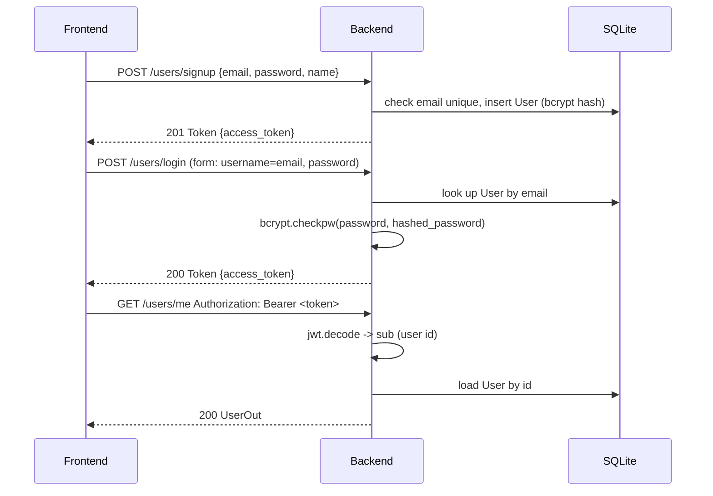
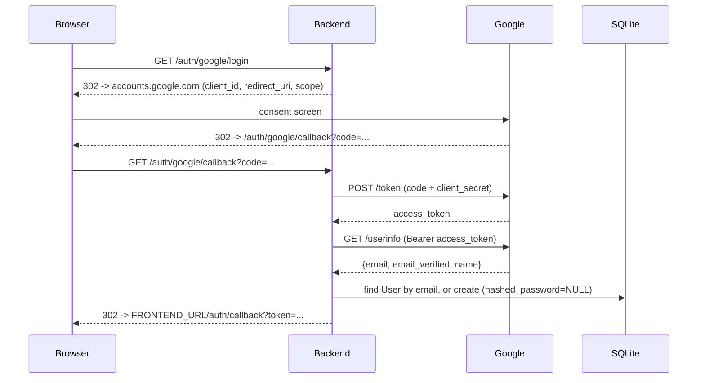

# Porchlight — authentication

Two ways in: email/password, and Google sign-in. Both end the same way — the client holds a Porchlight-issued JWT and sends it as `Authorization: Bearer <token>` on protected routes. Porchlight never stores a Google-issued token; Google is only used once, at login, to establish who you are.

## Password auth



`/users/login` takes `OAuth2PasswordRequestForm` (form-encoded `username`/`password`, not JSON) — the standard FastAPI shape, and it's why the `username` field holds an email. This also means Swagger's built-in "Authorize" button works out of the box.

Signup auto-issues a token (returns `Token`, not just the created user) so the frontend doesn't need a second round trip to log in right after registering.

## Google sign-in



This is the standard server-side OAuth2 **authorization code** flow, not the client-side "ID token" flow — the browser never sees Google's tokens, only the authorization `code`, and the backend is the only party that ever presents the client secret. That's also why the returned `access_token`/userinfo are trusted without independently re-verifying a signature: they arrived over a channel authenticated by the client secret, not something a browser could have tampered with in transit.

### Account linking

No separate `google_id` column. A Google login is matched to an existing account purely by **verified** email (`userinfo.email_verified` must be true) — if found, that user is logged in; if not, a new `User` is created with `hashed_password = NULL`. That's the entire linking strategy: one nullable column instead of a new table. A user who signed up with a password and later clicks "Sign in with Google" with the same email lands in the same account automatically.

The trade-off: `User.hashed_password` being nullable means `/users/login` has to handle a Google-only account explicitly — it returns `401 "This account signs in with Google"` instead of crashing on `bcrypt.checkpw(None)`.

### Known simplifications

- **No CSRF `state` param.** The `/auth/google/login` → `/auth/google/callback` round trip skips the OAuth `state` parameter that's normally used to bind the callback to the browser session that started it. Acceptable for this scope; a production build would generate and validate one.
- **No refresh tokens, from either provider.** Porchlight's own JWT is access-token-only with a 1-week expiry (see [ARCHITECTURE.md](ARCHITECTURE.md#auth)); Google's `access_type` is requested as `online`, not `offline`, so no Google refresh token is even issued.

## Endpoints

| Method | Path | Auth | Notes |
|---|---|---|---|
| POST | `/users/signup` | — | JSON body, `409` if email taken |
| POST | `/users/login` | — | Form body (`username`=email, `password`), `401` on bad credentials |
| GET | `/users/me` | Bearer | Returns the caller's own `UserOut` |
| GET | `/auth/google/login` | — | `302` redirect to Google's consent screen |
| GET | `/auth/google/callback` | — | Google redirects here with `?code=`; ends in a `302` back to the frontend with `?token=` |

## JWT

- Header/payload: standard `HS256`, signed with `SECRET_KEY`.
- Payload: `{"sub": "<user.id>", "exp": <unix timestamp>}` — subject is the numeric user ID, not the email, so it stays valid if the user later changes their email.
- Verified in `get_current_user` (`backend/auth.py`): decode, pull `sub`, load the `User` by ID, `401` (with `WWW-Authenticate: Bearer`) on any failure — missing token, bad signature, expired, or a `sub` that no longer resolves to a user.

## Config

All settings live in `backend/auth.py`'s `Settings` (`pydantic-settings`, reads `.env` if present — see `backend/.env.example`). Every field has a working local-dev default, including `SECRET_KEY`, so the app runs with zero configuration; only Google sign-in requires real values (`GOOGLE_CLIENT_ID`, `GOOGLE_CLIENT_SECRET`) before it'll do anything beyond redirect to a broken consent screen.

| Setting | Default | Purpose |
|---|---|---|
| `SECRET_KEY` | `dev-insecure-secret-change-me` | JWT signing key — override before deploying |
| `GOOGLE_CLIENT_ID` / `GOOGLE_CLIENT_SECRET` | `""` | From Google Cloud Console |
| `GOOGLE_REDIRECT_URI` | `http://localhost:8000/auth/google/callback` | Must exactly match the URI registered in Google Cloud Console |
| `FRONTEND_URL` | `http://localhost:3000` | Where the Google callback sends the browser after issuing a token |

## Verifying

```sh
uv run python auth.py    # hashing + JWT round-trip + tamper/expiry rejection + authorize-URL shape
uv run dev                # then curl the endpoints above
```

The Google flow's redirect and error handling (bad/missing `code`) can be checked without real credentials; completing an actual login requires a real `GOOGLE_CLIENT_ID`/`GOOGLE_CLIENT_SECRET` in `.env` and a browser click-through of Google's consent screen.
