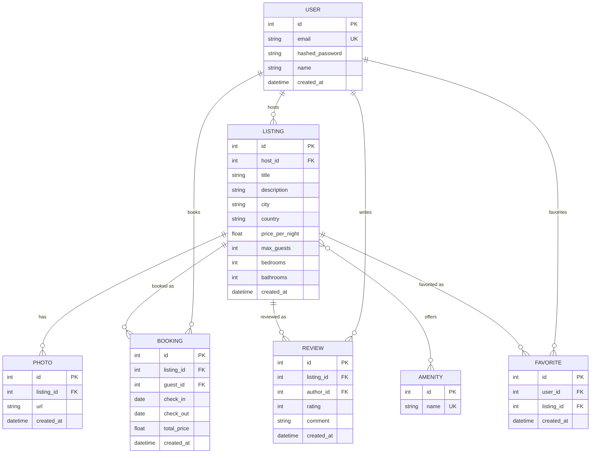

# Porchlight — database schema

SQLite via SQLAlchemy 2.0 (`Mapped`/`mapped_column` declarative style). Models live in `backend/models/`, one file per entity; `backend/models/__init__.py` re-exports everything so callers do `from models import User, Listing, ...`. `Base.metadata.create_all()` creates all tables on startup — no Alembic migrations at this scope (see [ARCHITECTURE.md](ARCHITECTURE.md#data-layer)).

## ER diagram



## Tables

| Model | File | Notes |
|---|---|---|
| `User` | `models/user.py` | One role — every user can host listings and book others'. `email` unique. |
| `Listing` | `models/listing.py` | Owned by a `User` (`host_id`). Also defines `listing_amenities`, the plain `Table` backing the `Listing`↔`Amenity` many-to-many. |
| `Photo` | `models/photo.py` | Belongs to one `Listing`. |
| `Amenity` | `models/amenity.py` | Flat lookup table (`wifi`, `parking`, ...), `name` unique. |
| `Booking` | `models/booking.py` | `guest_id` → `User`, `listing_id` → `Listing`, date range `[check_in, check_out)`. |
| `Review` | `models/review.py` | One review per `(listing_id, author_id)` — enforced by a `UniqueConstraint`. |
| `Favorite` | `models/favorite.py` | One favorite per `(user_id, listing_id)` — enforced by a `UniqueConstraint`. |

## Design decisions

- **Cascade deletes flow from `Listing`.** Deleting a listing cascades to its `Photo`, `Booking`, `Review`, and `Favorite` rows (`cascade="all, delete-orphan"`). Simplest behavior for a demo; a production app would likely soft-delete or block deletion once bookings exist so trip/review history survives.
- **Money is `float`, not `Decimal`/cents.** Acceptable for seeded demo data; would need fixed-point storage before handling real payments.
- **Booking overlap isn't a DB constraint.** SQLite can't express exclusion constraints cleanly, so double-booking prevention happens in the service layer (`routers/bookings.py`, not yet built) via a query, not schema.
- **No status/cancellation workflow.** `Booking` has no `status` column — create + list only. Add one if cancellation is needed.
- **Forward references across files use `TYPE_CHECKING`.** Each model file imports its sibling models only under `if TYPE_CHECKING:` and starts with `from __future__ import annotations`, so annotations can be written as bare names (`Mapped[list[Booking]]`, no quotes) while `ruff`/`ty` still resolve them. This isn't optional style — `User` and `Listing` (and others) reference each other bidirectionally, so a real top-level import on both sides deadlocks with `ImportError: cannot import name 'X' from partially initialized module` the moment either file loads. SQLAlchemy itself doesn't need the import at all; it resolves relationship targets by class name via its own mapper registry, not Python's import system — the `TYPE_CHECKING` import exists purely so static tools see a defined name.

## Verifying the schema

```sh
uv run python -m models
```

Builds every table in an in-memory SQLite DB, exercises each relationship (including the `Listing`↔`Amenity` many-to-many and cascade delete), and asserts the results. See `backend/models/__init__.py::demo`.
